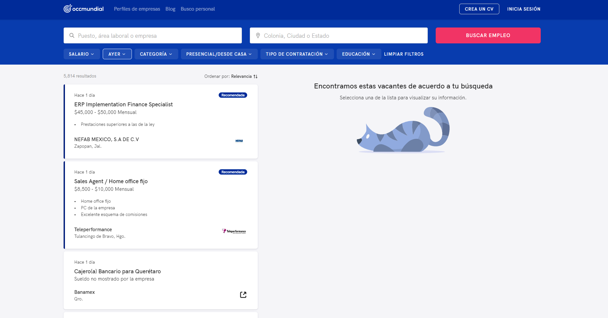

<h1 align="center">Welcome to reto-mayor 👋</h1>
<p>
  
  <a href="https://github.com/krowdycareers/reto-mayor#readme" target="_blank">
    
  </a>
  <a href="https://github.com/krowdycareers/reto-mayor/graphs/commit-activity" target="_blank">
    
  </a>
  <a href="https://github.com/krowdycareers/reto-mayor/blob/master/LICENSE" target="_blank">
    
  </a>
</p>



> Proyecto de web scraping para obtencion de data por paginacion y antes de ello el filtrado.
> Se filtra para el dia de "Hoy" luego se selecciona la informacion del rango de pago y asimismo la direccion, de todas las paginaciones

### 🏠 [Homepage](https://github.com/krowdycareers/reto-mayor#readme)

## Install

```sh
npm install
```

## Usage

```sh
npm run start
```

## Author
 
👤 **Marcos Alanya Pacheco - Perú**
* Email: marcosalanya19@gmail.com
* Website: https://marcos-alanya-portafolio.vercel.app/
* Github: [@MarcosAlanya19](https://github.com/MarcosAlanya19)
* LinkedIn: [@marcosalanya19](https://linkedin.com/in/marcosalanya19)
