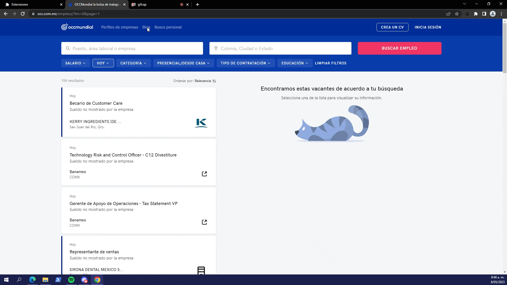

# Reto Job Scraper Bootcamp Krowdy

Primero reto de el bootcamp de Desarrollo Web de Krowdy Academy, este consistía en:

- Desarrollar una Chrome extension.
- Scrapear todos los avisos del día de la Bolsa de trabajo [OCCMundial](https://www.occ.com.mx/empleos/?tm=0&page=1).
- Comunicar el **background.js** y el **contentscript.js** con el popup de la extensión para así mostrar los resultados.
- Filtrar y ordenar los resultados por localidad, y por cada localidad indicar cuantos empleos hay para cada rango salarial.

## Demo de la extensión

## Sustentación

Una Chrome extension se basa principalmente en 4 archivos, para esta, se utilizaron los siguientes con sus respectivas funcionalidades:

- El **index.html** es el más simple, trae el diseño del popup de la extensión con la que interactuaría el usuario.
  - **Botón obtener resultados del día:** Al presionar este botón, se comienza a scrapear la información. Una vez finalice este proceso, se enseña el resultado.
  - **Botón ver resultados obtenidos:** Al minimizar una extensión, el contenido de esta se reinicia, por lo que si accidentalmente se llegara a minimar y ya se tiene el resultado, se puede volver a enseñar.
  - **Botón reiniciar:** Si se quiere volver a ejecutar el scrapeo, se puede reiniciar el storage.
- El **index.js** le agrega lógica y funcionalidad a la extensión, haciendo que cuando se presione alguno de los botones, se ejecute alguna acción en específico.
  - **listener start:** Le añade al botón de "obtener resultados del día" la funcionalidad de comenzar la ejecución del scraping.
  - **listener reset:** Le añade al botón de "reiniciar" la funcionalidad de reinicar el storage.
  - **listener update:** Le añade al botón de "reiniciar" la funcionalidad de llamar al método updateData().
  - **updateData():** Busca el resultado obtenido en el chrome storage, y coloca el resultado obtenido en el popup.
  - **end listener:** Espera un mensaje de finalización del scraping que viene desde el background, y cuando este llega, se muestra la información obtenida por el sraping
- El **contentscript.j:s** es el que se encarga de extraer toda la información de los elementos del DOM, y cada trabajo lo transforma en una entidad. Le permite al popup, conectarse a la página.
  - **listener scrap:** Espera un comando "scrap" y cuando este llega, llama al método getJobs(), cuando finaliza, envía la respuesta al background.
  - **getJobs():** Obtiene los elementos del DOM que representan un trabajo, y de estos obtiene la información de cada trabajo.
- El **background.js:** cumple principalmente la función de persistir la información, ya que esta extensión requiere paginar, si no tuvieramos el popup, todo lo scrapeado se perdería una vez se cambie de página. Tambien organiza toda la información que le manda el contentscript, se encarga de la paginación, y al final retorna el resultado al popup.
  - **listener start:** Espera un comando "start" que viene desde el popup, cuando este llega comienza el proceso de la paginación.
  - **changeTabToNextPage():** Es el que realiza como tal la paginación, solo se ejecuta si existe una siguiente página.
  - **listener getinfo:** Espera un mensaje "getInfo" el cual filtra los resultados obtenidos del contentscript y los almacena en el chrome storage.
  - **filterIncomingJobs:** Recibe la información de cada página que le envía el contentscript, y la organiza por localidad y rango salarial.
